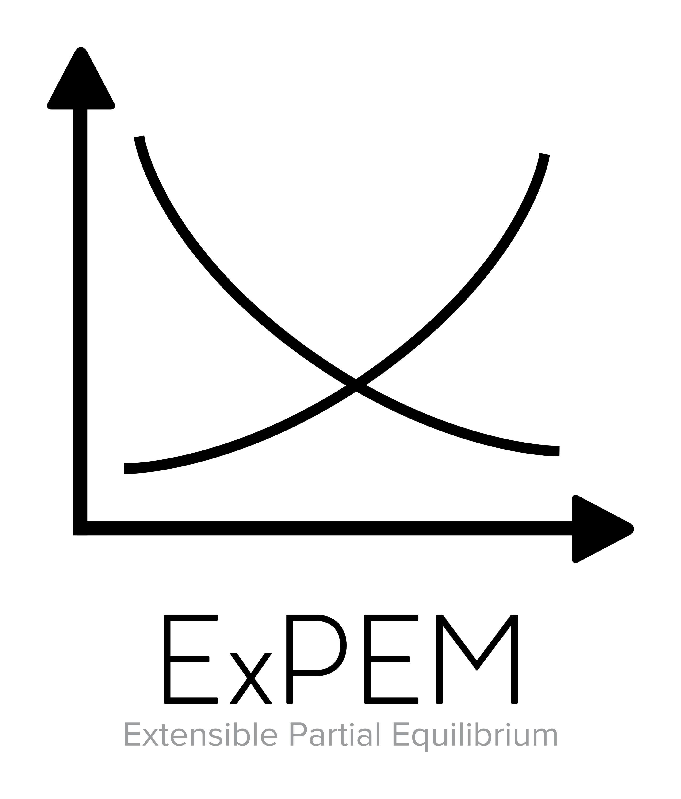

# AD.PartialEquilibriumApi
C# framework for programming Partial Equilibrium models.

[](https://zenodo.org/badge/latestdoi/80772157)

## Install from NuGet:
```Powershell
PM> Install-Package AD.PartialEquilibriumApi
```

## Description
For a detailed description of the structure of an ExPEM-type model, see [Model Description](https://github.com/austindrenski/AD.PartialEquilibriumApi/wiki/Model-Description)

## Purpose
This library aims to provide the tools necessary to construct partial equilibrium models that are object-oriented, simple to create, and extensible.

Implementations of this library are known as Extensible Partial Equilibrium Modeling (ExPEM) type models. An official implementation of this library is currently under development and can be previewed under: [AD.PartialEquilibriumApi.Example](https://github.com/austindrenski/AD.PartialEquilibriumApi/tree/master/AD.PartialEquilibriumApi.Example). The production-ready implementations will be released under: [ExPEM](https://github.com/austindrenski/ExPEM).

## Motivation
Partial equilibrium (PE) models are simple and lightweight, but programming one can be complicated by the hierarchical nature of the linkages. This library proposes the use of the Extensible Markup Language (XML) to represent the model in an intuitive and object-oriented manner.

XML is designed to represent relational data. This works well for PE models characterized by layers of horizontal and vertical linkages. However, object-oriented design is not a principle concern of the XML specification, and PE models are easily imagined as the interaction between objects (e.g. markets, products). To align these two characteristics, this library relies on the .NET Language-Integrated Query (LINQ) library which provides for the object-oriented navigation of complicated relational linkages.

The primary goal of this library is to help write code that mirrors the graphical representation of a model.

```
                                  -----------------
                                  |  Downstream   | 
                                  -----------------
                                 /                 \   
                                /                   \   
                               /                     \         
                 --------------                       --------------
                 | Upstream 1 |                       | Upstream 2 |
                 --------------                       --------------
                /              \                                    \
               /                \                                    \
              /                  \                                    \
--------------                    --------------                       --------------    
| Upstream 3 |                    | Upstream 4 |                       | Upstream 5 |
--------------                    --------------                       --------------
```

```XML
<Downstream>
  <Upstream1 />
    <Upstream3 />
    <Upstream4 />
  <Upstream2 />
    <Upstream5 />
</Downstream>
```

```C#
XElement downstream = new XElement("Downstream");
XElement upstream1 = new XElement("Upstream1", new XAttribute("Price", 1));
XElement upstream2 = new XElement("Upstream2", new XAttribute("Price", 1));
XElement upstream3 = new XElement("Upstream3", new XAttribute("Price", 1));
XElement upstream4 = new XElement("Upstream4", new XAttribute("Price", 1));
XElement upstream5 = new XElement("Upstream5", new XAttribute("Price", 1));

downstream.Add(upstream1, upstream2);
upstream1.Add(upstream3, upstream4);
upstream2.Add(upstream5)'

double a = downstream.Select(x => (double) x.Attribute("Price")
                     .Select(x => x * 3)
                     .Sum();
// a == 6

double b = downstream.Element("Upstream2")
                     .Select(x => (double) x.Attribute("Price"))
                     .Select(x => x * 2)
                     .Select(x => x + 2)
                     .Sum();
// b == 8
```

***


The AD.PartialEquilibriumApi library is part of the ExPEM project. For more information, please visit [ExPEM](https://github.com/austindrenski/ExPEM).


